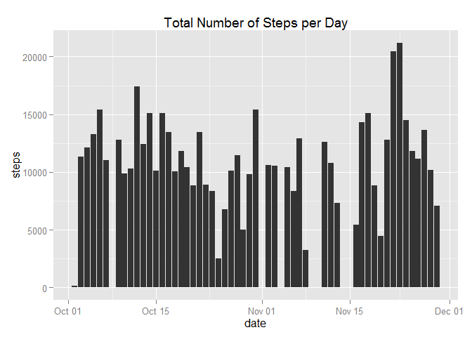
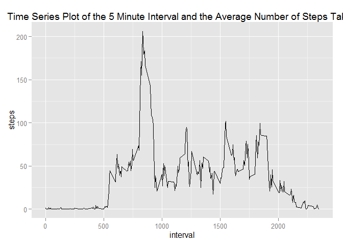
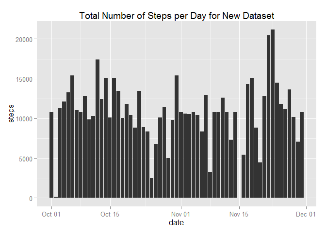
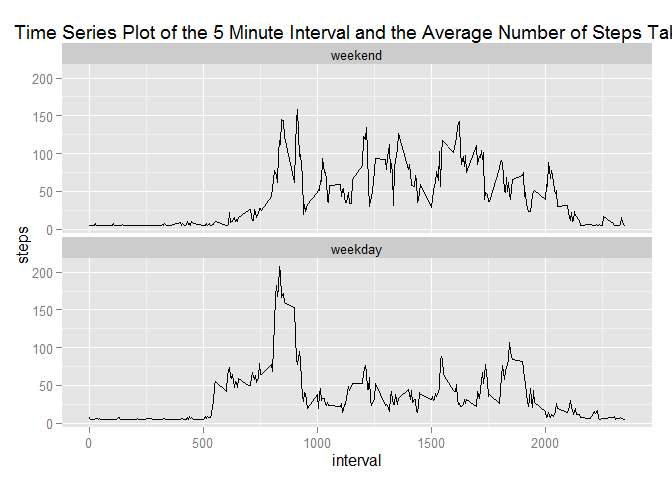

# Reproducible Research: Peer Assessment 1


## Loading and preprocessing the data

```r
step_data = read.csv("C:\\Users\\krodriguez\\Documents\\Coursera\\Reproducible Research\\Week 2\\RepData_PeerAssessment1\\activity\\activity.csv", stringsAsFactors = FALSE)
```

## What is mean total number of steps taken per day?

```r
omit_data = na.omit(step_data)

omit_data_sum = aggregate(steps ~ date, omit_data, sum)
omit_data_sum$date = as.Date(omit_data_sum$date)

ggplot(omit_data_sum, aes(x=date, y=steps)) + geom_histogram(stat="identity") + scale_x_date(breaks = waiver()) + ggtitle("Total Number of Steps per Day")
```

 

####This is the average number of steps by day

```r
print(aggregate(steps ~ date, omit_data, mean))
```

```
         date      steps
1  2012-10-02  0.4375000
2  2012-10-03 39.4166667
3  2012-10-04 42.0694444
4  2012-10-05 46.1597222
5  2012-10-06 53.5416667
6  2012-10-07 38.2465278
7  2012-10-09 44.4826389
8  2012-10-10 34.3750000
9  2012-10-11 35.7777778
10 2012-10-12 60.3541667
11 2012-10-13 43.1458333
12 2012-10-14 52.4236111
13 2012-10-15 35.2048611
14 2012-10-16 52.3750000
15 2012-10-17 46.7083333
16 2012-10-18 34.9166667
17 2012-10-19 41.0729167
18 2012-10-20 36.0937500
19 2012-10-21 30.6284722
20 2012-10-22 46.7361111
21 2012-10-23 30.9652778
22 2012-10-24 29.0104167
23 2012-10-25  8.6527778
24 2012-10-26 23.5347222
25 2012-10-27 35.1354167
26 2012-10-28 39.7847222
27 2012-10-29 17.4236111
28 2012-10-30 34.0937500
29 2012-10-31 53.5208333
30 2012-11-02 36.8055556
31 2012-11-03 36.7048611
32 2012-11-05 36.2465278
33 2012-11-06 28.9375000
34 2012-11-07 44.7326389
35 2012-11-08 11.1770833
36 2012-11-11 43.7777778
37 2012-11-12 37.3784722
38 2012-11-13 25.4722222
39 2012-11-15  0.1423611
40 2012-11-16 18.8923611
41 2012-11-17 49.7881944
42 2012-11-18 52.4652778
43 2012-11-19 30.6979167
44 2012-11-20 15.5277778
45 2012-11-21 44.3993056
46 2012-11-22 70.9270833
47 2012-11-23 73.5902778
48 2012-11-24 50.2708333
49 2012-11-25 41.0902778
50 2012-11-26 38.7569444
51 2012-11-27 47.3819444
52 2012-11-28 35.3576389
53 2012-11-29 24.4687500
```

####This is the median number of steps by day

```r
print(aggregate(steps ~ date, omit_data, median))
```

```
         date steps
1  2012-10-02     0
2  2012-10-03     0
3  2012-10-04     0
4  2012-10-05     0
5  2012-10-06     0
6  2012-10-07     0
7  2012-10-09     0
8  2012-10-10     0
9  2012-10-11     0
10 2012-10-12     0
11 2012-10-13     0
12 2012-10-14     0
13 2012-10-15     0
14 2012-10-16     0
15 2012-10-17     0
16 2012-10-18     0
17 2012-10-19     0
18 2012-10-20     0
19 2012-10-21     0
20 2012-10-22     0
21 2012-10-23     0
22 2012-10-24     0
23 2012-10-25     0
24 2012-10-26     0
25 2012-10-27     0
26 2012-10-28     0
27 2012-10-29     0
28 2012-10-30     0
29 2012-10-31     0
30 2012-11-02     0
31 2012-11-03     0
32 2012-11-05     0
33 2012-11-06     0
34 2012-11-07     0
35 2012-11-08     0
36 2012-11-11     0
37 2012-11-12     0
38 2012-11-13     0
39 2012-11-15     0
40 2012-11-16     0
41 2012-11-17     0
42 2012-11-18     0
43 2012-11-19     0
44 2012-11-20     0
45 2012-11-21     0
46 2012-11-22     0
47 2012-11-23     0
48 2012-11-24     0
49 2012-11-25     0
50 2012-11-26     0
51 2012-11-27     0
52 2012-11-28     0
53 2012-11-29     0
```


## What is the average daily activity pattern?

```r
omit_data_avg = aggregate(steps ~ interval, omit_data, mean)

ggplot(omit_data_avg, aes(x=interval, y = steps)) + geom_line() + ggtitle("Time Series Plot of the 5 Minute Interval and the Average Number of Steps Taken")
```

 

####This is the highest 5-minute Interval that on Average Contains the Maximum Number of Steps 

```r
max_interval =  omit_data_avg[which(omit_data_avg$steps == max(omit_data_avg$steps)),]
print(max_interval$interval, row.names = FALSE)
```

```
[1] 835
```

## Imputing missing values
#### This is the Total Number of NA values in the data set

```r
sum(is.na(step_data))
```

```
[1] 2304
```

#### This is the New Dataset with NAs replaced with the Average of Steps for the Whole Data Set

```r
step_data_filled = step_data
step_data_filled$steps[is.na(step_data_filled$steps)] = mean(step_data_filled$steps, na.rm = TRUE)
```
#### This is the Total Number of Steps Taken by Day for the Dataset with NAs replaced 

```r
data_sum= aggregate(steps ~ date, step_data_filled, sum)
data_sum$date = as.Date(data_sum$date)

ggplot(data_sum, aes(x=date, y=steps)) + geom_histogram(stat="identity") + scale_x_date(breaks = waiver()) + ggtitle("Total Number of Steps per Day for New Dataset")
```

 

#### This is the Mean of Total Number of Steps Taken Each Day for the New Dataset

```r
aggregate(steps ~ date, step_data_filled, mean)
```

```
         date      steps
1  2012-10-01 37.3825996
2  2012-10-02  0.4375000
3  2012-10-03 39.4166667
4  2012-10-04 42.0694444
5  2012-10-05 46.1597222
6  2012-10-06 53.5416667
7  2012-10-07 38.2465278
8  2012-10-08 37.3825996
9  2012-10-09 44.4826389
10 2012-10-10 34.3750000
11 2012-10-11 35.7777778
12 2012-10-12 60.3541667
13 2012-10-13 43.1458333
14 2012-10-14 52.4236111
15 2012-10-15 35.2048611
16 2012-10-16 52.3750000
17 2012-10-17 46.7083333
18 2012-10-18 34.9166667
19 2012-10-19 41.0729167
20 2012-10-20 36.0937500
21 2012-10-21 30.6284722
22 2012-10-22 46.7361111
23 2012-10-23 30.9652778
24 2012-10-24 29.0104167
25 2012-10-25  8.6527778
26 2012-10-26 23.5347222
27 2012-10-27 35.1354167
28 2012-10-28 39.7847222
29 2012-10-29 17.4236111
30 2012-10-30 34.0937500
31 2012-10-31 53.5208333
32 2012-11-01 37.3825996
33 2012-11-02 36.8055556
34 2012-11-03 36.7048611
35 2012-11-04 37.3825996
36 2012-11-05 36.2465278
37 2012-11-06 28.9375000
38 2012-11-07 44.7326389
39 2012-11-08 11.1770833
40 2012-11-09 37.3825996
41 2012-11-10 37.3825996
42 2012-11-11 43.7777778
43 2012-11-12 37.3784722
44 2012-11-13 25.4722222
45 2012-11-14 37.3825996
46 2012-11-15  0.1423611
47 2012-11-16 18.8923611
48 2012-11-17 49.7881944
49 2012-11-18 52.4652778
50 2012-11-19 30.6979167
51 2012-11-20 15.5277778
52 2012-11-21 44.3993056
53 2012-11-22 70.9270833
54 2012-11-23 73.5902778
55 2012-11-24 50.2708333
56 2012-11-25 41.0902778
57 2012-11-26 38.7569444
58 2012-11-27 47.3819444
59 2012-11-28 35.3576389
60 2012-11-29 24.4687500
61 2012-11-30 37.3825996
```

#### This is the Median of Total Number of Steps Taken Each Day for the New Dataset

```r
aggregate(steps ~ date, step_data_filled, median)
```

```
         date   steps
1  2012-10-01 37.3826
2  2012-10-02  0.0000
3  2012-10-03  0.0000
4  2012-10-04  0.0000
5  2012-10-05  0.0000
6  2012-10-06  0.0000
7  2012-10-07  0.0000
8  2012-10-08 37.3826
9  2012-10-09  0.0000
10 2012-10-10  0.0000
11 2012-10-11  0.0000
12 2012-10-12  0.0000
13 2012-10-13  0.0000
14 2012-10-14  0.0000
15 2012-10-15  0.0000
16 2012-10-16  0.0000
17 2012-10-17  0.0000
18 2012-10-18  0.0000
19 2012-10-19  0.0000
20 2012-10-20  0.0000
21 2012-10-21  0.0000
22 2012-10-22  0.0000
23 2012-10-23  0.0000
24 2012-10-24  0.0000
25 2012-10-25  0.0000
26 2012-10-26  0.0000
27 2012-10-27  0.0000
28 2012-10-28  0.0000
29 2012-10-29  0.0000
30 2012-10-30  0.0000
31 2012-10-31  0.0000
32 2012-11-01 37.3826
33 2012-11-02  0.0000
34 2012-11-03  0.0000
35 2012-11-04 37.3826
36 2012-11-05  0.0000
37 2012-11-06  0.0000
38 2012-11-07  0.0000
39 2012-11-08  0.0000
40 2012-11-09 37.3826
41 2012-11-10 37.3826
42 2012-11-11  0.0000
43 2012-11-12  0.0000
44 2012-11-13  0.0000
45 2012-11-14 37.3826
46 2012-11-15  0.0000
47 2012-11-16  0.0000
48 2012-11-17  0.0000
49 2012-11-18  0.0000
50 2012-11-19  0.0000
51 2012-11-20  0.0000
52 2012-11-21  0.0000
53 2012-11-22  0.0000
54 2012-11-23  0.0000
55 2012-11-24  0.0000
56 2012-11-25  0.0000
57 2012-11-26  0.0000
58 2012-11-27  0.0000
59 2012-11-28  0.0000
60 2012-11-29  0.0000
61 2012-11-30 37.3826
```
After replacing NA values with the average of steps for the whole dataset, there is a slight effect on the estimates of the total number of steps taken per day.

The most noticeable effect is on the median and average calculations for days with data containing a high number of NAs. More speficially, days 10-1, 10-8, 11-1, 11-4, 11-9, 11-10, 11-14, 11-30 all showed a sharp increase in median from 0 to 37.38. This is because the original dataset contained majority NAs for these specific days. This resulted in the replacement from NA to 37.38 for most entries in those days.


## Are there differences in activity patterns between weekdays and weekends?

```r
step_data_filled$date = as.Date(step_data_filled$date)

days = as.data.frame(weekdays(step_data_filled$date), stringsAsFactors = TRUE )
colnames(days) = "day"

step_data_filled = cbind(step_data_filled, days)

weekend = c("Saturday", "Sunday")
step_data_filled$weekday <- factor((step_data_filled$day %in% weekend), 
         levels=c(TRUE, FALSE), labels=c('weekend', 'weekday')) 

data_avg_weekend = aggregate(steps ~ interval * weekday, step_data_filled, mean)

ggplot(data_avg_weekend, aes(x=interval, y = steps, group = weekday)) + geom_line() + ggtitle("Time Series Plot of the 5 Minute Interval and the Average Number of Steps Taken") + facet_wrap(~weekday , ncol = 1)
```

 
